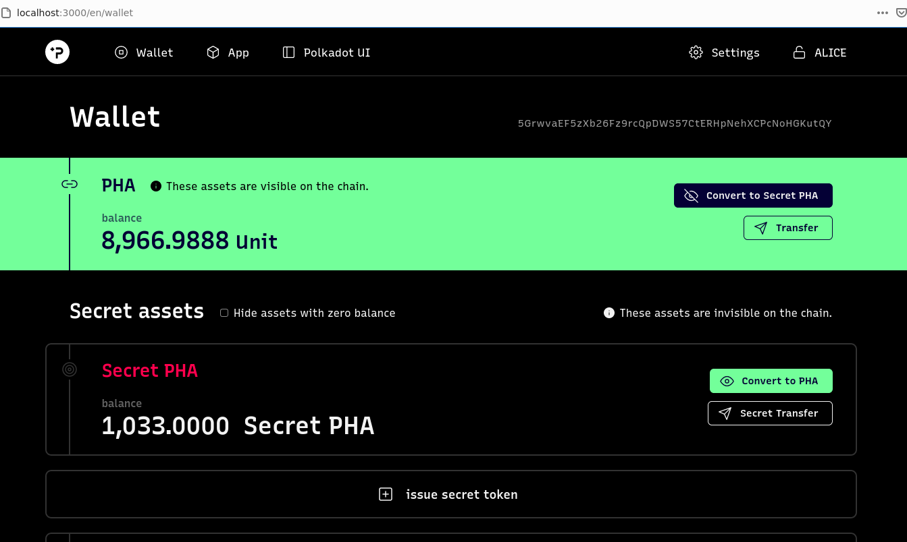

Hackathon: Hello World! by Polkadot
[ECOSYSTEM CHALLENGE] (Beginner) Build And Run A Local Phala Network

Twitter Link
https://twitter.com/CemUney_BI/status/1324070087935119360

Discord Link
https://discord.com/channels/697726436211163147/706401317240963142/773629553943380039

<h3> phala-node </h3>
</img>

<h3> prune time </h3>
</img>

<h3> phost </h3>
</img>

<h3> secret assets </h3>
</img>

